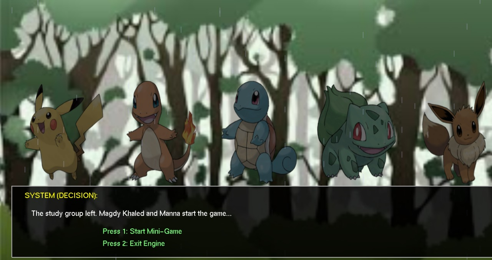
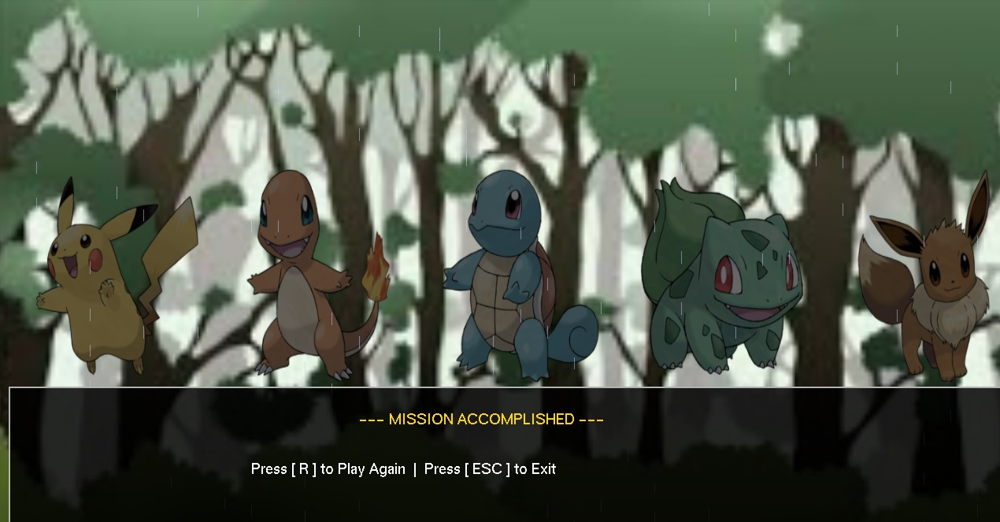
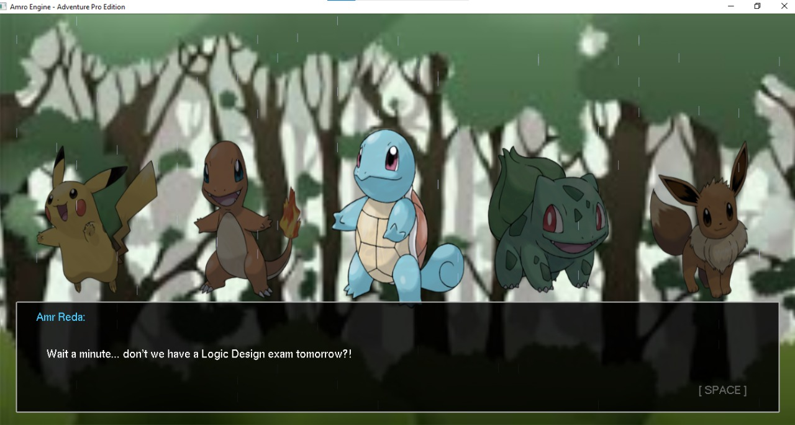
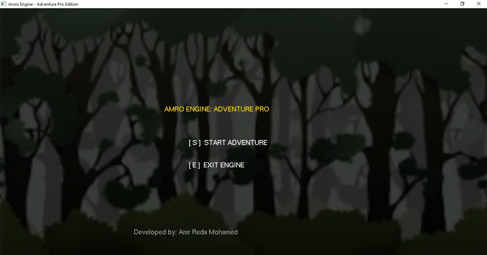
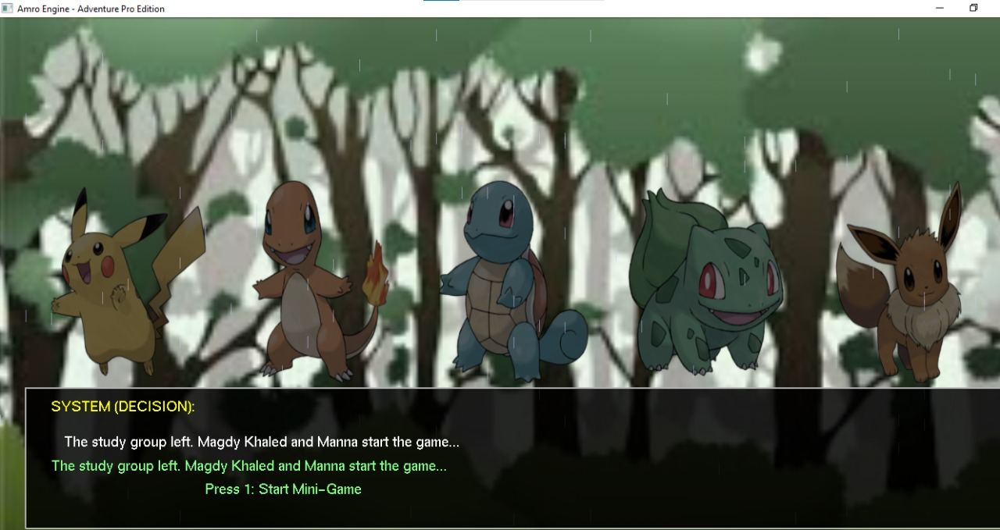

# 🚀 Amro Engine: Interactive Visual Novel System
**A Data-Driven 2D Game Engine built from scratch using C++ and OpenGL.**


---

## 🌟 Project Overview
**Amro Engine** is a high-performance 2D narrative engine developed as a **Computer Graphics Course Project**. It demonstrates how to build a modular game system that bridges high-level data (JSON) with low-level graphics rendering (OpenGL). The engine is designed to handle complex branching storylines and atmospheric visual effects with high efficiency.

---

## 🚀 Key Features
- 📜 **JSON-Based Scripting:** Manage entire game dialogues, choices, and logic through external files without recompiling code.
- ⌨️ **Typewriter Text Rendering:** Smooth, character-by-character text animation for a professional RPG experience.
- ⛈️ **Dynamic Particle System:** Real-time rain simulation with gravity physics and automatic recycling for memory optimization.
- 🎭 **Interactive Decision System:** Support for multiple-choice paths that dynamically load different story files.
- 🔊 **Audio Integration:** Synchronized sound effects using Windows Multimedia (winmm) for immersive gameplay.
- ✨ **Cinematic Effects:** Implements screen shaking (Shake), flashes (Flash), and smooth fade-ins (Fade).

---

## 📸 Gallery (Screenshots)
| 🖼️ Main Menu | 💬 Gameplay & Atmosphere | 🛠️ Choice System |
| :---: | :---: | :---: |
|  |  |  |

| 🏁 Mission Accomplished | ⌨️ Typewriter Effect |
| :---: | :---: |
|  |  |

---

## 🛠️ Technical Implementation (Graphics Concepts)
This engine serves as a practical application of core **Computer Graphics** principles:
1. **Orthographic Projection:** Custom 2D coordinate mapping (HD 1280x720) using `gluOrtho2D`.
2. **Alpha Blending:** Utilizing `GL_BLEND` for UI transparency, layering, and weather effects.
3. **Texture Mapping:** Efficient sprite and background rendering via `stb_image`.
4. **State Machine:** Managing game flow (Menu vs. Gameplay) through an optimized state-based logic.
5. **Animation Math:** Dynamic "breathing" effects and particle motion using sine functions and translation matrices.

---

## ⚙️ Build & Run
To compile and run the engine on Windows (MinGW), use the following command:

```bash
g++ main.cpp -o AmroEngine.exe -lfreeglut -lglu32 -lopengl32 -lwinmm
./AmroEngine.exe